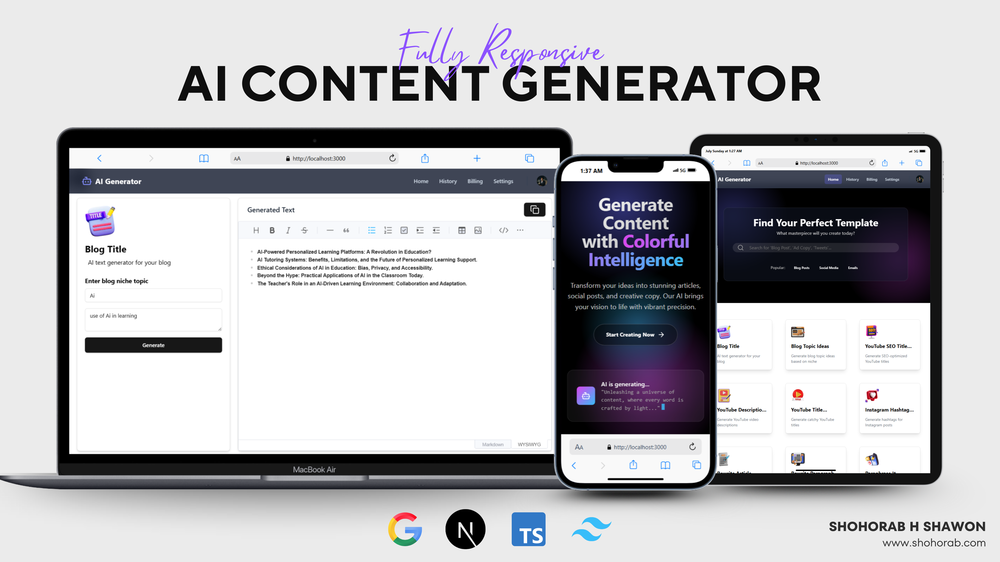

# AI Content Generator



This is an AI-powered content writing web application built with [Next.js](https://nextjs.org), leveraging the Gemini API for content generation, [Clerk](https://clerk.com/) for authentication, and [Neon](https://neon.tech/) as the database.

## Features

- ✨ Generate high-quality content using the Gemini API
- 🔒 Secure authentication and user management with Clerk
- 🗄️ Scalable and serverless PostgreSQL database with Neon
- ⚡ Modern Next.js 14+ app directory structure
- 🎨 Optimized fonts and responsive UI

## Getting Started

1. **Clone the repository:**
    ```bash
    git clone https://github.com/your-username/aicontentgenerator.git
    cd aicontentgenerator
    ```

2. **Install dependencies:**
    ```bash
    npm install
    # or
    yarn install
    ```

3. **Set up environment variables:**

    Create a `.env.local` file in the root directory and add your credentials:
    ```
    GEMINI_API_KEY=your_gemini_api_key
    CLERK_PUBLISHABLE_KEY=your_clerk_publishable_key
    CLERK_SECRET_KEY=your_clerk_secret_key
    DATABASE_URL=your_neon_database_url
    ```

4. **Run the development server:**
    ```bash
    npm run dev
    # or
    yarn dev
    ```

5. **Open [http://localhost:3000](http://localhost:3000) in your browser.**

## Project Structure

- `app/` — Next.js app directory (pages, layouts, API routes)
- `components/` — Reusable React components
- `lib/` — Utility functions and API integrations
- `db/` — Database schema and queries

## Deployment

Deploy your app easily on [Vercel](https://vercel.com/) or any platform supporting Next.js.

## Learn More

- [Next.js Documentation](https://nextjs.org/docs)
- [Gemini API Docs](https://ai.google.dev/gemini-api/docs)
- [Clerk Docs](https://clerk.com/docs)
- [Neon Docs](https://neon.tech/docs)

---

Feel free to contribute or open issues to improve this project!
